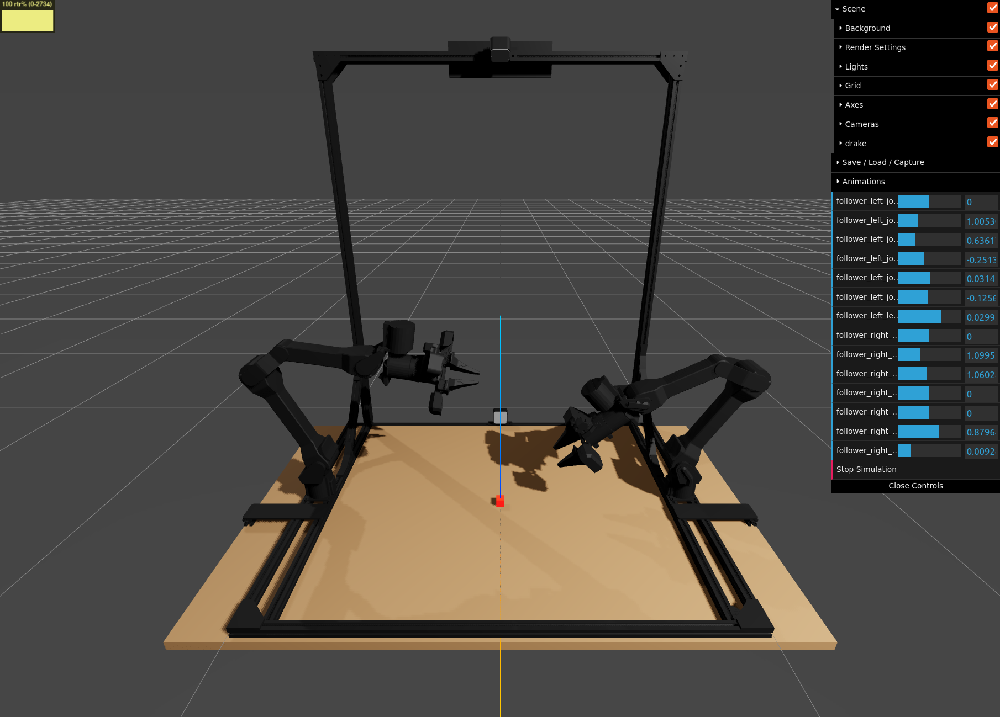

# Trossen Arm Drake

A Drake-compatible model of the bimanual [Trossen Stationary
AI](https://www.trossenrobotics.com/stationary-ai) (formerly Aloha 2) robot with
[hydroelastic contact](https://arxiv.org/abs/2110.04157) and 
[CENIC](https://arxiv.org/abs/2511.08771) error-controlled integration.



Adopted from the [Trossen Arm
Description](https://github.com/TrossenRobotics/trossen_arm_description).

## Installation

Clone this repository:

```bash
git clone https://github.com/vincekurtz/trossen_arm_drake.git
cd trossen_arm_drake
```

Create a virtual environment and install dependencies:

```bash
python3 -m venv .venv
source .venv/bin/activate
pip install -r requirements.txt
```

## Usage

Activate the virtual environment:

```bash
source .venv/bin/activate
```

View the model in MeshCat (with hydroelastics enabled):

```bash
python -m pydrake.visualization.model_visualizer urdf/stationary_ai.urdf --compliance_type compliant
```

Run an interactive simulation (use MeshCat sliders to control the robot):

```bash
./simulate.py
```
